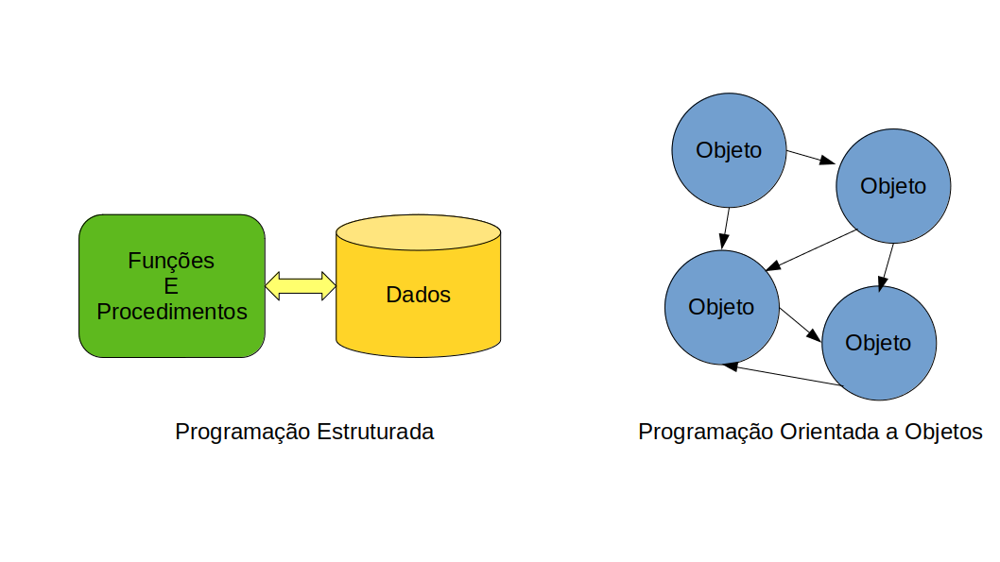
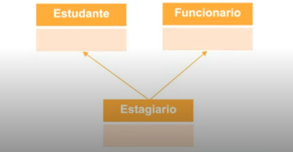
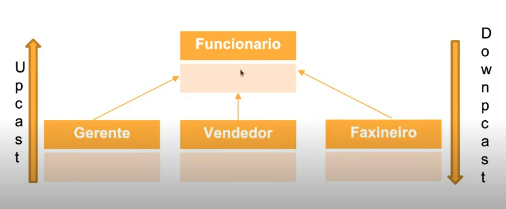
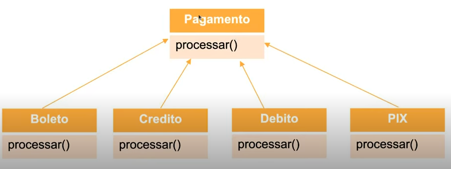
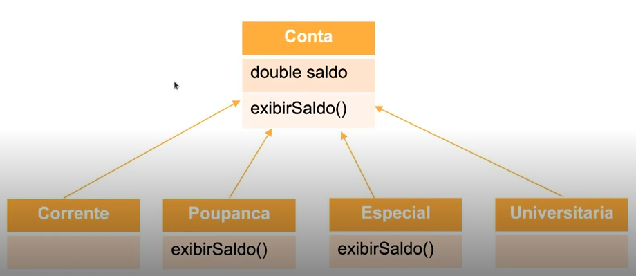
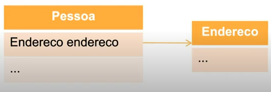
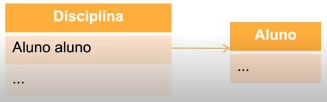
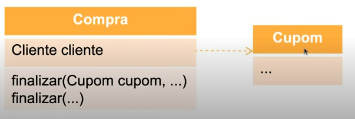

# Programação Orientada a Objetos em Java

## Getting Started

**Clone this repository**

You can clone this repository with the following command:

```bash
# SSH
git clone git@github.com:alexandresantosm/spring-framework-experiencie.git

# HTTPS
git clone https://github.com/alexandresantosm/spring-framework-experience.git
```

## 1. Por que usar Programação Orientada a Objetos?

**Programação Estruturada vs Programação Orientada a Objetos**

| Paradigma Estruturado                 | Paradigma Orientado a Objetos                               |
| ------------------------------------- | ----------------------------------------------------------- |
| Tem uma representação mais simplista. | Tem uma representação mais realista.                        |
| Foca em operações(funções) e dados.   | Foca na modelagem de entidades e nas interações entre elas. |
| Foca mais no "Como fazer".            | Foca mais no "O que fazer".                                 |

**Vantagens da Programação Orientada a Objetos**

- Melhor coesão;
- Melhor acoplamento;
- Diminuição do gap semântico;
- Coletor de lixo.

**Resumo**



---

## 2. Fundamentos da Programação Orientada a Objetos

> "A Orientação a Objetos é um paradigma de análise, projeto e programação de sistemas de software baseado na composição e interação entre diversas unidades de software chamadas de objetos."
>
> ― Saiba mais em [Wikipedia](https://pt.wikipedia.org/wiki/Orientação_a_objetos).

**Pilares da Orientação a Objetos**

- **Abstração**

  > "Processo pelo qual se isolam características de um objeto, considerando os que tenham em comum certos grupos de objetos."
  >
  > ― [Dicionário Michaelis](https://michaelis.uol.com.br/busca?id=mdq).

- **Reuso**

  > "Capacidade de criar novas unidades de código a partir de outras já existentes."
  >
  > ― Autor Desconhecido.

- **Encapsulamento**

  > "Capacidade de esconder complexidades e proteger dados."
  >
  > ― Autor Desconhecido.

**Exercício**

Levando em consideração uma loja on-line de livros, modele uma entidade livro.

_Livro_

_Quantidade de páginas - Tema - Edição - Ano de Publicação - Peso - Editora - Tipo de Papel - Tipo de Capa - Assunto - Autor - ISBN - Idioma - Título - Subtítulo - Dimensões - Quantidade de Capítulos - Gramatúra - Acabamento - Coloração._

**Solução do exercício:**

**1. Entidade Livro**

Quantidade de páginas - Editora - Assunto - Autor - ISBN - Título.

**1. Entidade Editora**

Quantidade de páginas - Peso - Tipo de Papel - Tipo de Capa - ISBN - Subtítulo - Dimensões - Gramatúra - Acabamento - Coloração.

---

## 3. Estrutura básica da Orientação a Objetos

- Classe;
- Atributo;
- Método;
- Objeto;
- Mensagem.

### Classe

> "É uma estrutura que abstrai um conjunto de objetos com características similares. Uma classe define o comportamento de seus objetos através de métodos e os estados possíveis destes objetos através de atributos. Em outros termos, uma classe descreve os serviços providos por seus objetos e quais informações eles podem armazenar."
>
> ― Saiba mais em [Wikipedia](<https://pt.wikipedia.org/wiki/Classe_(programação)>).

**Exemplos de classes:**

- Bola;
- Carro;
- Venda;
- Viagem;
- Comprador;
- Computador.

> [!TIP]
>
> - Substantivos;
> - Nome significativos;
> - Contexto deve ser considerado.

**Códigos:**

Classe implementada na linguagem _Java_:

```java
// Essa é uma classe
class Carro {
  ...
}
```

Classe implementada na linguagem _C#_:

```c#
// Essa é uma classe
class Carro {
  ...
}
```

Classe implementada na linguagem _Python_:

```py
# Essa é uma classe
class Carro:
  pass
```

**Exercício**

Crie a classe Carro.

> [!TRIP]
>
> Use a linguagem que gostar e siga as dicas sobre como criar classes!

**Solução do exercício:**

```java
class Carro {
  ...
}
```

### Atributo

> "É o elemento de uma classe responsável por definir sua estrutura de dados. O conjunto destes será responsável por representar suas características e fará parte dos objetos criados a partir da classe."
>
> ― Tiago Leite e Carvalho.

**Exemplos de atridutos de classes:**

- Bola;
  - Diâmetro.
- Carro;
  - Cor.
- Venda;
  - Valor.
- Viagem;
  - Distância.
- Comprador;
  - Nome.
- Computador.
  - Memória.

**Atributo vs Variável**

_Atributo_

O que é próprio e peculiar a alguém ou alguma coisa.

_Variável_

Sujeito a variações ou mudanças; que pode variar; inconstante, instável.

> [!TIP]
>
> - Substantivos e adjetivos;
> - Nome significativos;
> - Contexto deve ser considerado;
> - Abstração;
> - Tipos adequados.

**Códigos:**

Atributo implementado na linguagem _Java_:

```java
class Carro {
  // Esse é um atributo
  int portas;
}
```

Atributo implementado na linguagem _C#_:

```c#
class Carro {
  // Esse é um atributo
  int portas;
}
```

Atributo implementado na linguagem _Python_:

```py
class Carro:
  # Esse é um atributo
  portas = 0
```

**Exercício**

Evolua o exercício 1 e defina três atributos para a classe "Carro": _cor_, _modelo_ e _capacidade do tanque_.

> [!TRIP]
>
> Use a linguagem que gostar e siga as dicas sobre como criar atributos!

**Solução do exercício**

```java
class Carro {
  String cor;
  String modelo;
  int capacidadeDoTanque;
}
```

### Método

> "É uma porção de código (sub-rotina) que é disponibilizada pela classe. Este é executado quando é feita uma requisição a ele. Um método serve para identificar quais serviços, ações, que a classe oferece. Eles são responsáveis por definir e realizar um determinado comportamento."
>
> ― Tiago Leite.
> .

**Exemplos de atridutos de classes:**

- Bola;
  - Diâmetro.
  - Girar.
- Carro;
  - Cor.
  - Ligar.
- Venda;
  - Valor.
  - Calcular total.
- Viagem;
  - Distância.
  - Consultar clima.
- Comprador;
  - Nome.
  - Realizar troca.
- Computador.

  - Memória.
  - Desligar.

  **Criação de método**

  | Java e C#    | Python     |
  | ------------ | ---------- |
  | Visibilidade | `def`      |
  | Retorno      | Nome       |
  | Nome         | Parâmetros |
  | Parâmetros   |            |

> [!TRIP]
>
> - Verbos;
> - Nomes significativos;
> - Contexto deve ser considerado.

**Códigos:**

Método implementado na linguagem _Java_:

```java
class Carro {
  int portas;

  // Esse é um método
  void frear () {
    ...
  }
}
```

Método implementado na linguagem _C#_:

```c#
class Carro {
  int portas;

  // Esse é um método
  void frear () {
    ...
  }
}
```

Método implementado na linguagem _Python_:

```py
class Carro:
  portas = 0

  # Esse é um método
  def frear ()
    ...
```

**Dois métodos especiais:**

- Construtor;
- Destrutor.

_Construtor_

Com o método construtor da classe é possível construir os objetos. Além da finalidade de criar objetos, através do construtor podemos prover alguns valores iniciais para os atributos quando necessário.

Método **construtor** implementado na linguagem _Java_:

```java
class Carro {
  // Esse é um método construtor
  Carro () {
    ...
  }
}
```

Método **construtor** implementado na linguagem _C#_:

```c#
class Carro {
  // Esse é um método construtor
  Carro () {
    ...
  }
}
```

Método **construtor** implementado na linguagem _Python_:

```py
class Carro:
  # Esse é um método construtor
  def __init__ (self)
    ...
```

_Destrutor_

Esse método auxilia a destruição do objeto.

Método **destrutor** implementado na linguagem _Java_:

```java
class Carro {
  // Esse é um método destrutor
  void finalize () {
    ...
  };
}
```

Método **destrutor** implementado na linguagem _C#_:

```c#
class Carro {
  // Esse é um método destrutor
  ~Carro () {
    ...
  }
}
```

Método **destrutor** implementado na linguagem _Python_:

```py
class Carro:
  # Esse é um método destrutor
  def __del__ (self)
    ...
```

**Sobrecarga de método**

Mudar a assinatura de acordo com a necessidade.

- Assinatura: _nome_ + _parâmetros_.

Sobrecarga de método implementado na linguagem _Java_:

```java
class Tabuada {

  void m1 () { ... };

  void m1 (int i) { ... };

  void m1 (float f) { ... };

  void m1 (String s, long l) { ... };

  void m1 (long l, String s) { ... };
}
```

Sobrecarga de método implementado na linguagem _C#_:

```c#
class Tabuada {

  void M1 () { ... };

  void M1 (int i) { ... };

  void M1 (float f) { ... };

  void M1 (String s, long l) { ... };

  void M1 (long l, String s) { ... };
}
```

A linguagem _Python_ não aceita sobrecarga de método:


**Exercício**

Evolua o conceito do exercício 2 e defina um método para a classe "Carro"para calcular o valor total para preencher o tanque. Este deve receber como parâmetro o valor da gasolina. Faça também duas sobrecargas do construtor.

> [!TRIP]
>
> Use a linguagem que gostar e siga as dicas sobre como criar método!
>
> Crie métodos específicos para fornecer e obter os valores dos atributos (get/set), caso aplicável.

**Solução do exercício**

```java
public class Carro {
  String cor;
  String modelo;
  int capacidadeDoTanque;

  public Carro () {}

  public Carro (String cor, String modelo, int capacidadeDoTanque) {
    this.cor = cor;
    this.modelo = modelo;
    this.capacidadeDoTanque = capacidadeDoTanque;
  }

  public double totalValorDoTanqueCheio (double valorDoCombustivel) {
    return getCapacidadeDoTanque() * valorDoCombustivel;
  }

  public String getCor() {
    return cor;
  }

  public void setCor(String cor) {
    this.cor = cor;
  }

  public String getModelo() {
    return modelo;
  }

  public void setModelo(String modelo) {
    this.modelo = modelo;
  }

  public int getCapacidadeDoTanque() {
    return capacidadeDoTanque;
  }

  public void setCapacidadeDoTanque(int capacidadeDoTanque) {
    this.capacidadeDoTanque = capacidadeDoTanque;
  }
}
```

### Objeto

> "Um objeto é a representação de um conceito/entidade do mundo real, que pode ser física (bola, carro, árvore, etc.) ou conceitual (viagem, estoque, compra, etc.) e possui um significado bem definido para um determinado software. Para esse conceito/entidade, deve ser definida inicialmente uma classe a partir da qual posteriormente serão instanciados objetos distintos."
>
> ― Thiago Leite.

**Código**

Instanciando um **objeto** na linguagem _Java_:

```java
// Criação de um objeto
Carro carro = new Carro ();
```

Instanciando um **objeto** na linguagem _C#_:

```c#
// Criação de um objeto
Carro carro = new Carro ();
```

Instanciando um **objeto** na linguagem _Python_:

```py
# Criação de um objeto
carro = Carro ()
```

### Mensagem

> "É o processo de ativação de um método de um objeto. Isto ocorre quando uma requisição (chamada) a esse método é realizada, assim disparando a execução de seu comportamento descrito por sua classe. Pode também ser direcionada diretamente à classe, caso a requisição seja a um método estático."
>
> ― Thiago Leite.

**Código**

Chamando um método na linguagem _Java_:

```java
// Executando um método
Carro carro = new Carro ();
carro.<método>;

Carro.<método>;
```

Chamando um método na linguagem _C#_:

```c#
// Executando um método
Carro carro = new Carro ();
carro.<método>;

Carro.<método>;
```

Chamando um método na linguagem _Python_:

```py
# Executando um método
carro = Carro ()
carro.<método>

Carro.<método>
```

### Outros conceitos:

- Instância x Estático: atributos e métodos;
- Estado de um Objeto;
- Identidade de um Objeto;
- Representação numérica de um Objeto;
- Representação padrão de um Objeto.

**Exercício**

Evolua o conceito do exercício 3 criando objetos da classe "Carro". Use os métodos get/set, quando aplicáveis, para definir os valores dos atributos e exibir estes valores "get". Passe também uma mensagem para o cálculo do total para encher o tanque.

> [!TRIP]
>
> Use a linguagem que gostar e siga as dicas sobre como criar método, atributos, etc!
>
> Use `System.out` _(Java)_, `Console.WriteLine` _(C#)_ ou `print` _(Python)_.

**Solução do exercício**

```java
public class App {
  public static void main(String[] args) throws Exception {

    var carro1 = new Car();

    carro1.setCor("Amarelo");
    carro1.setModelo("Ferrari");
    carro1.setCapacidadeDotanque(65);

    System.out.println(carro1.getCor());
    System.out.println(carro1.getModelo());
    System.out.println(carro1.getCapacidadeDotanque());
    System.out.println(carro1.totalValorDoTanqueCheio(7.58));

    System.out.println();

    var carro2 = new Carro("Banco", "VW Kombi", 45);

    System.out.println(carro2.getCor());
    System.out.println(carro2.getModelo());
    System.out.println(carro2.getCapacidadeDotanque());
    System.out.println(carro2.totalValorDoTanqueCheio(7.58));
  }
}
```

---

## 4. As relações: Herança, Associação e Interface

### Herança

> "É o relacionamento entre classes em que uma classe chamada de _subclasse_ (classe filha, classe derivada) é uma extensão, um subtipo, de outra classe chamada se _superclasse_ (classe pai, classe mãe, classe base). Devido a isto, a subclasse consegue reaproveitar os atributos e métodos dela. Além dos que venham a ser herdados, a subclasse pode definir seus próprios membros."
>
> ― Thiago Leite.

**Código**

Herança na linguagem _Java_:

```java
// Herança
class A extends B {
  ...
}
```

Herança na linguagem _C#_:

```c#
// Herança
class A : B {
  ...
}
```

Herança na linguagem _Python_:

```py
# Herança
class A (B):
  ...
```

**Exercício**

Crie a classe "Veículo", "Carro", "Moto" e "Caminhão".

> [!TRIP]
>
> Use a linguagem que gostar e siga as dicas sobre como criar classes! Faça a relação de herança que julgue adequada.

**Solução do exercício**

```java
class Veiculo {
  // Atributos e métodos
}

class Carro extends Veiculo {
  // Atributos e métodos
}

class Moto extends Veiculo {
  // Atributos e métodos
}

class Caminhao extends Veiculo {
  // Atributos e métodos
}
```

**Tipos de herança**

- **Simples**

  A classe filha tem só uma classe mãe.

  

- **Múltipla**

  A classe filha tem uma ou mais classes mães.

  

> [!NOTE]
>
> As linguagens Java e C# não implementam a herança multipla, já as linguagens Python e C++ sim.

**Código**

Herança Múltipla na linguagem _Python_:

```py
  class A (B, C):
    pass
```

**Typecasting**

> Typecasting é um dos conceitos mais importantes que basicamente lida com a conversão de um tipo de dados para outro tipo de dados implícita ou explicitamente.
>
> ― [Acervo Lima](https://acervolima.com/upcasting-vs-downcasting-em-java/)

Existem dois tipos de tipificação. Eles são:

- **Upcast** é o typecasting de um objeto filho para um objeto pai . O upcasting pode ser feito _implicitamente_.

- **Downcast** é o typecasting de um objeto pai para um objeto filho . O downcasting não pode ser implícito, ele sempre será _explicito_.



**Polimorfismo**

> "A mesma ação, se comportando diferente."



**Sobrescrita**

> "A mesma ação, podendo se comportar diferente."



**Exercício sobre Typecasting**

Crie a classe "Funcionario", "Gerente", "Vendedor" e "Faxineiro". Realize upcast e downcast.

> [!TRIP]
>
> Use a linguagem que gostar e siga as dicas sobre como criar classes! Faça a relação de herança de acordo com a imagem na seção que fala sobre upcast e downcast.

**Solução do exercício**

```java
public class App {

  public class Funcionario {}

  public class Gerente extends Funcionario {}

  public class Vendedor extends Funcionario {}

  public class Faxineiro extends Funcionario {}

  public static void main(String[] args) {

    Employee employee = new Employee();

    //Upcast

    Funcionario gerente = new Gerente();
    Funcionario vendedor = new Vendedor();
    Funcionario faxineiro = new Faxineiro();

    //Downcast

    //Gerente gerente_ = new Funcionario();
    Vendedor vendedor_ = (Vendedor) new Funcionario();

  }

}
```

**Exercício sobre Polimorfismo e Sobrecarga**

Analise do comportamento de Polimorfismo e Sobrecarga.

**Solução do exercício**

```java
public class RunApp {

  public class ClasseMae {

    void method1 () {
      System.out.println("Método 1 da Classe Mãe");
    }

    void method2 () {
      System.out.println("Método 2 da Classe Mãe");
    }

  }

  public class ClasseFilha2 extends ClasseMae {

    @Override
    void method1() {
      System.out.println("Método 1 da Classe Filha 1");
    }

  }

  public class ClasseFilha2 extends ClasseMae {

    @Override
    void method1() {
      System.out.println("Método 1 da Classe Filha 2");
    }

    @Override
    void method2() {
      System.out.println("Método 2 da Classe Filha 2");
    }

  }

  public static void main(String[] args) {

    ClasseMae[] classes = new ClasseMae[]{new ClasseFilha1(), new ClasseFilha2(), new ClasseMae()};

    for (ClasseMae c : classes) {
      c.method1();
    }

    System.out.println("");

    ClasseFilha2 ClasseFilha2 = new ClasseFilha2();
    ClasseFilha2.method2();
  }

}
```

### Associação

> "Possibilita um relacionamento entre classes/objetos, no qual estes posssam pedir ajuda a outras classes/objetos e representar de forma completa o conceito ao qual se destinam. Neste tipo de relacionamento, as classes e os objetos interagem entre si para atingir seus objetivos."
>
> ― Tiago Leite.

**Tipos de Associações**

- Estrutural:
  - Composição;
  - Agregação.
- Comportamental:
  - Dependência.

**Estrutural**

Se manisfesta na estrutura das classes/objetos, ou seja, nos atributos.

_Composição_: "Com parte todo", ou seja, as classes/objetos dependem uma da outra para existirem.

Exemplo: Pessoa e Endereço.



**Código**

Associação Estrutural do tipo Composição na linguagem _Java_:

```java
  class Pessoa {
    Endereco endereco;
  }
```

_Agregação_: "Sem parte todo", ou seja, as classes/objetos não dependem uma da outra para existirem, são independentes.

Exemplo: Disciplina e Aluno.



**Código**

Associação Estrutural do tipo Composição na linguagem _Java_:

```java
  class Disciplina {
    Aluno aluno;
  }
```

**Comportamental**

Se manisfesta nos comportamentos das classes/objetos, ou seja, nos métodos.

_Dependência_: "Depende de", ou seja, as classes usam objetos de outras classes em seus métodos.

Exemplo: Compra e Cupom.



**Código**

Associação Comportamental do tipo Dependência na linguagem _Java_:

```java
class Compra {

  finalizar () {
    ...
  }

  finalizar (Cupom cupom) {
    ...
  }

}
```

**Exercício sobre Associação**

Apenas para praticar, codifique os exemplos dos slides anteriores sobre associação.

> [!TRIP]
>
> Use a linguagem que gostar e siga as dicas sobre como criar classes!

**Solução do exercício**

```java
// Associação Estrutural: Composição
class Endereco {}

class Pessoa {
  Endereco endereco;
}

// Associação Estrutural: Agregação
class Aluno {}

class Disciplina {
  Aluno aluno;
}

// Associação Comportamental: Dependência
class Cupon {}

class Compra {
  finalizar () {}

  finalizar (Cupon cupon) {
    ...
  }

}
```

### Interface

> "Define um contrato que deve ser seguido pela classe que a implementa. Quando uma classe implementa uma interface, ela se compromete a realizar todos os comportamentos que a interface disponibiliza."
>
> ― Tiago Leite.

**Código**

Interface na linguagem _Java_:

```java
interface A {
  ...
}

class B implements A {
  ...
}
```

Interface na linguagem _C#_:

```c#
interface A {
  ...
}

class B : A {
  ...
}
```

_Python_ não possui interface.

**Exercício sobre Interface**

Apenas para praticar, crie uma interface chamada "OperacaoMatematica". Crie também quatro métodos das operações básicas: soma, subtração, multiplicação e divisão.

> [!TRIP]
>
> Use a linguagem que gostar e siga as dicas sobre como criar classes! Tente não implementar algum dos métodos e veja o que acontece.

**Solução do exercício**

```java
public interface OperacaoMatematica {
  void somar (double operando1, double operando2);

  void subtrair (double operando1, double operando2);

  void multiplicar (double operando1, double operando2);

  void dividir (double operando1, double operando2);
}

public class Calculadora implements OperacaoMatematica {

  @Override
  public void somar(double operando1, double operando2) {
    ...
  }

  @Override
  public void subtarir(double operando1, double operando2) {
    ...
  }

  @Override
  public void multiplicar(double operando1, double operando2) {
    ...
  }

  @Override
  public void dividir(double operando1, double operando2) {
    ...
  }

}
```

## 5. A organização de Pacotes e Visibilidade

### Pacotes

> "São uma organização física ou lógica criada para separar classes com responsabilidades distintas. Com isso, espera-se que a aplicação fique mais organizada e seja possível separar classes de finalidades e representatividade diferentes."
>
> ― Tiago Leite.

**Código**

Pacotes na linguagem _Java_:

```java
package ...;

import ...;
```

Pacotes na linguagem _C#_:

```c#
namespace {...}

using ...;
```

Pacotes na linguagem _C#_:

```py
// A partir da versão 2.x
__init__.py

from ...
import ...
```

### Visibilidade

> "Um modificador de acesso tem como finalidade determinar até que ponto uma classe, atributo ou método pode ser usado. A utilização de modificadores de acesso é fundamental para o uso efetivo da Orientação a Objetos. Algumas boas práticas e conceitos só são atingidos com o uso corretos deles."
>
> ― Tiago Leite.

**Tipos de Visibilidades**

- Private;
- Protected;
- Public.

_Private_

A classe, atributo ou método pode ser usado dentro da própria classe onde foi criado.

**Código**

Visibilidade privada na linguagem _Java_:

```java
private class Classe {};

private int i;

private int do ();
```

Visibilidade privada na linguagem _C#_:

```c#
private class Classe {};

private int i;

private int do ();
```

_Protected_

A classe, atributo ou método pode ser usado dentro da própria classe onde foi criado, em classes de um mesmo pacote e em subclasses.

**Código**

Visibilidade protegida na linguagem _Java_:

```java
protected class Classe {};

protected int i;

protected int do ();
```

Visibilidade protegida na linguagem _C#_:

```c#
protected class Classe {};

protected int i;

protected int do ();
```

_Public_

A classe, atributo ou método pode ser usado em qualquer lugar da aplicação.

**Código**

Visibilidade publica na linguagem _Java_:

```java
public class Classe {};

public int i;

public int do ();
```

Visibilidade publica na linguagem _C#_:

```c#
public class Classe {};

public int i;

public int do ();
```

## Próximos passos

- Padrões de Projetos (Desing Patterns);
- Boas práticas: SOLID, código, técnicas de programação, etc.;
- Refatoração;
- UML;
- Frameworks;
- **_MUITA_** prática e estudo.
